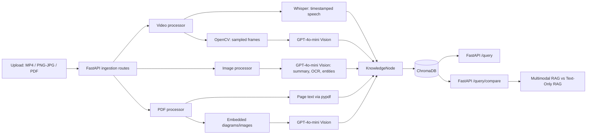

# Gradient-Rush: Multimodal Data Management Pipeline for RAG-Ready Systems

Gradient-Rush turns videos, images, and PDFs into retrieval-ready knowledge that keeps the evidence users actually need: what was said, what was shown, and where it appeared.

## Overview & Problem Statement

Most RAG pipelines reduce source material to plain text. That loses the architecture diagram on a slide, the OCR text in a screenshot, the page location in a PDF, and the time window in which a speaker explained it.

Gradient-Rush bridges these gaps by combining speech transcription, sampled video frames, image/PDF OCR-style visual analysis, and document context into a single searchable knowledge layer. Every indexed item carries its source, modality, time range or page locator, extracted frame path, transcript, and visual summary—so retrieval can return grounded multimodal evidence instead of disconnected text fragments.

## Key Architectural Features

- **Time-aligned video understanding:** Whisper produces timestamped transcript segments, OpenCV samples frames on a fixed interval, and GPT-4o-mini Vision describes diagrams, visible text, layouts, and other important visual context. Each video `KnowledgeNode` aligns narration to its frame window.
- **Unified `KnowledgeNode` metadata:** Nodes preserve modality (`video`, `image`, or `pdf`), source filename, timestamp/page locator, frame path, entities, provenance, extracted text, and visual summary.
- **Persistent cross-modal retrieval:** ChromaDB persists the `multimodal_knowledge` collection locally. Its embedding documents combine text/transcript and visual summary for semantic search across modalities.
- **Baseline comparison for judges:** `/query/compare` searches both the multimodal collection and a companion transcript-only collection. This makes the benefit of visual context measurable side by side against Text-Only RAG.
- **Demo-friendly artifacts:** Extracted video frames and PDF visual artifacts are stored under `data/frames/` and exposed at `/frames` for quick inspection.

## Architecture



## API Endpoints

| Endpoint | Purpose |
| --- | --- |
| `POST /upload/video` | Upload an MP4, transcribe it, sample frames, generate visual summaries, and index aligned video nodes. |
| `POST /upload/audio` | Upload an audio file, transcribe it, and index timestamped transcript nodes. |
| `POST /upload/image` | Upload a PNG/JPEG, generate a visual summary, OCR-style text extraction, entities, and index one image node. |
| `POST /upload/pdf` | Upload a PDF, extract page text and embedded visual artifacts, and index one node per page. |
| `POST /upload/json` | Upload a JSON file — a single object or an array of `{text/content, locator, source, entities}` records — and index one node per record. For structured data you already have (tickets, logs, metadata) that doesn't need OCR/ASR/vision. |
| `POST /query` | Search the combined transcript/text + visual-summary multimodal index and get back a synthesized, cross-modal-grounded `answer` alongside the raw ranked results. |
| `POST /query/compare` | Compare the top multimodal result with the top transcript-only baseline result. |
| `GET /frames/{filename}` | Preview extracted video or PDF image artifacts during a demo. |
| `GET /docs` | Explore the interactive FastAPI/OpenAPI documentation. |

## Try it instantly with the bundled sample data

`test_data/samples/` ships real video/audio/image/pdf/json files for one
consistent test scenario, split across modalities on purpose — see
[`test_data/samples/README.md`](test_data/samples/README.md). No downloads,
recording, or API keys required to get a first result:

```bash
python test_data/seed_cross_modal_demo.py      # seeds equivalent knowledge directly, no keys needed
python test_data/test_cross_modal_query.py     # asserts retrieval + answer actually span modalities
```

Or, with `.env` configured and the server running, exercise the real
pipeline end to end:

```bash
uvicorn main:app --reload &
python test_data/upload_samples.py             # uploads every sample through /upload/*, then runs the demo query
```

### Example semantic query

```bash
curl -X POST http://127.0.0.1:8000/query \
  -H "Content-Type: application/json" \
  -d '{"query":"Where is the event-driven architecture shown?", "limit":5}'
```

Results include the spoken transcript, GPT-4o-mini visual summary, timestamp or page locator, extracted frame path, source filename, modality, similarity score, and distance.

### Compare multimodal retrieval with the baseline

```bash
curl -X POST http://127.0.0.1:8000/query/compare \
  -H "Content-Type: application/json" \
  -d '{"query":"Which diagram shows the gateway?", "limit":5}'
```

```json
{
  "query": "Which diagram shows the gateway?",
  "multimodal_result": {
    "transcript": "...",
    "visual_summary": "The frame shows an API gateway in front of event consumers.",
    "timestamp": "00:10 - 00:20",
    "frame_path": ".../data/frames/frame_00_10.jpg",
    "source": "architecture-demo.mp4",
    "modality": "video",
    "similarity_score": 0.82,
    "distance": 0.18
  },
  "text_only_baseline_result": {
    "transcript": "...",
    "visual_summary": null,
    "timestamp": "00:40 - 00:50",
    "frame_path": "...",
    "source": "architecture-demo.mp4",
    "modality": "video",
    "similarity_score": 0.51,
    "distance": 0.49
  }
}
```

## Setup & Quickstart

### 1. Create and activate a virtual environment

```bash
python -m venv .venv
```

Windows PowerShell:

```powershell
.\.venv\Scripts\Activate.ps1
```

macOS/Linux:

```bash
source .venv/bin/activate
```

### 2. Install dependencies

```bash
pip install -r requirements.txt
```

### 3. Configure OpenAI credentials

Create a `.env` file in the repository root:

```dotenv
OPENAI_API_KEY=your_api_key_here
```

The API key is used for Whisper transcription and GPT-4o-mini Vision analysis. ChromaDB data is stored locally in `./chroma_db`.

### 4. Start the API

```bash
uvicorn main:app --reload
```

Open `http://127.0.0.1:8000/docs` to upload media and run retrieval queries. Extracted frames are previewable under `http://127.0.0.1:8000/frames/`.

## Future Improvements

- **Temporal knowledge graphs:** connect people, concepts, frames, pages, and transcript segments as explicit time-aware relationships.
- **Real-time streaming ingestion:** process live audio/video incrementally and make partial knowledge searchable before an upload completes.
- **Custom chunking policies:** support modality-aware chunk boundaries, scene changes, speaker turns, page sections, and domain-specific document structure.
- **Evaluation harness:** add curated benchmark queries and retrieval metrics to quantify multimodal gains across technical demos.

## Judge Demo Checklist

1. Upload a short architecture/video walkthrough with narration and slides.
2. Query for a concept visible in a diagram.
3. Open the returned frame under `/frames` and verify the timestamped evidence.
4. Run the same query through `/query/compare` to show why transcript-only retrieval misses visual context.
